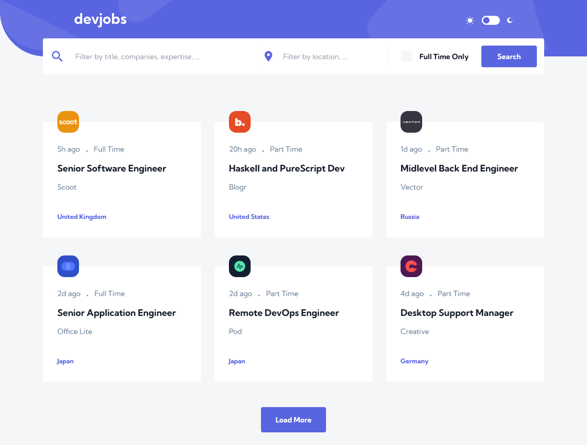

# DevJobs app

<p align="center">
  <a href="https://skillicons.dev">
    
  </a>
</p>

<p align="center">
   
</p>


## Launching with `docker compose`

```cmd
$ docker compose up
```

## Launching with local server

<details><summary>Launching the frontend server</summary>

Position yourself in the `frontend` folder before starting and launch Docker. 

```cmd
$ npm i

$ npm run dev
```
</details>

<details><summary>Launching the backend server</summary>

Position yourself in the `backend` folder before starting and launch Docker.

### Virtual environment installation and activation

**Warning**, for *MacOS*, the second command line may be different

```cmd
$ python -m venv env

// Windows
$ source env/Scripts/activate
// Mac
$ source env/bin/activate
```

### Package installation

```cmd
$ pip install -r requirements.txt
```

If a new installation is made in the virtual environment, don't forget to run 

```cmd
$ pip freeze > requirements.txt
```

### Launch local server

```cmd
python app.py
```
</details>

## User stories

Your users should be able to:

- [ ] Be able to filter jobs on the index page by title, location, and whether a job is for a full-time position
- [x] Be able to click a job from the index page so that they can read more information and apply for the job
- [x] View the optimal layout for each page depending on their device's screen size
- [x] See hover states for all interactive elements throughout the site
- [x] Have the correct color scheme chosen for them based on their computer preferences
- [x] Build this project as a full-stack application


## Built with

- Semantic HTML5 markup
- TailwindCSS
- React-TS
- Storybook
- Chromatic
- Python - Flask
- Docker

## Authors

- Frontend - [@amel-selmane ](https://github.com/amel-selmane)
- Backend/Docker - [@CalcagnoLoic](https://github.com/CalcagnoLoic)